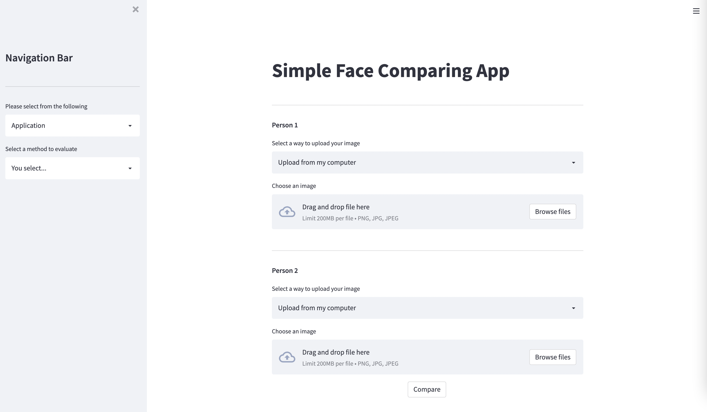

# **Face Comparing Project**

## **Introduction**

✍ An simple face comparing app using [**VGG-16**](https://keras.io/api/applications/vgg/#vgg16-function) to extract features, compare two photos and see if they are the same person.


## **Project pipeline:**
</br>

> ### 1. Get input (images) from user.
</br>

> ### 2. Using **MTCNN** to detect face.
</br>

> ### 3. Processing face detected in step 2.
</br>

> ### 4. Using **VGG-16** to extract features as vectors.
</br>

> ### 5. Evaluating 2 vectors using **Cosine Similarity** or **Euclidean Distance (L2 Norm)**.
</br>

> ### 6. Building User Interface (UI) by using **Streamlit**.


<br/>


## **Tutorial**

I highly recommend you performing on virtual environment by using [**Anaconda**](https://docs.anaconda.com/anaconda/install/index.html).

### **Activating your virtual environment**

```
conda activate [your_venv_name]
```

### **Cloning repository**

```
git clone https://github.com/ntvuongg/face-comparing.git
```

### **Installing requirements**

```
pip install -r requirements.txt
```

### **Running app**

```
streamlit run main.py
```

### **Demo**


